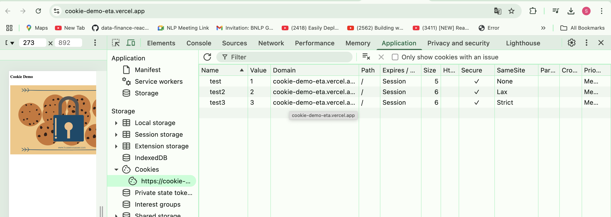
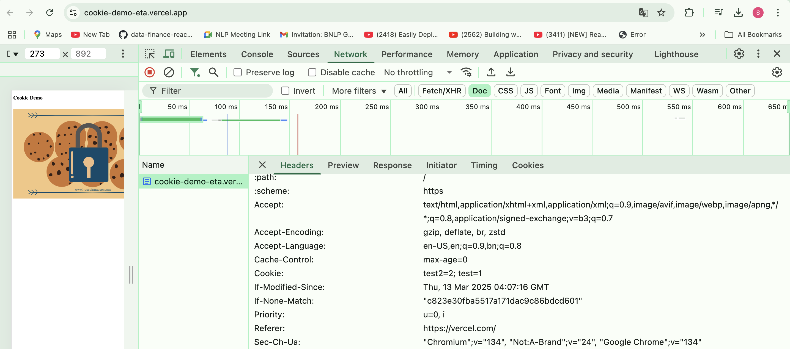

## Problems  

### 1. Varcel does not add ```SameSite=Strict``` cookie to the request header even the request is from same site.  

### Cookie is set in ```https://cookie-demo-eta.vercel.app/```
<br>


### Varcel does not send ```SameSite=Strict``` cookie for example here ```test3=3``` while I am reloading the page.  



<br>

### 2. localhost:3000 and localhost:8080 shares the cookies. 
